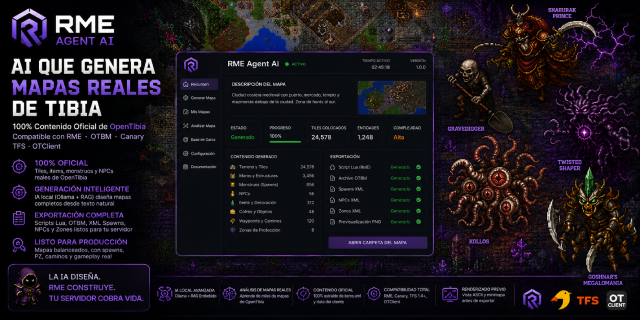

<div align="center">



# Agente RME v1.0.0 GA

**AI que genera mapas reales de Tibia**  
**100% Contenido Oficial de OpenTibia**


**Compatible con:** RME · OTBM · Canary · TFS · OTClient

---

## 📋 Descripción General

**RME Agent AI** es un generador de mapas para **OpenTibia** impulsado por **inteligencia artificial local** (Ollama + RAG).

El sistema toma una **descripción en lenguaje natural** del mapa deseado y genera automáticamente:

- Scripts **Lua** compatibles con **Remere's Map Editor (RME)**
- Archivos binarios **OTBM** listos para servidores
- Spawns y NPCs en formato XML
- Previews (ASCII + PNG)

Todo el contenido es **100% oficial** de OpenTibia (extraído directamente de `items.xml`, `monster.xml` y `npc.xml`).

> *"La IA diseña. RME construye. Tu servidor cobra vida."*

---

## ✨ Características Principales

### Generación de Mapas

- 🏰 **Ciudades** completas (calles, edificios, templos, NPCs)
- 🗡️ **Mazmorras** (salas, pasillos, jefes, trampas)
- 🌲 **Zonas de hunt** con spawns progresivos y balanceados
- 🏝️ **Islas** y terrenos naturales
- 🔄 **Mapas híbridos** (ciudad + mazmorra)

### Inteligencia Artificial

- 🧠 **AIPlanner**: Convierte texto en planes de construcción detallados
- 📐 **WorldBrain**: Sistema de razonamiento con objetivos y restricciones
- 🔍 **RAG embebido**: Recuperación semántica de items, monstruos y NPCs
- 🧬 **PatternLibrary**: Aprendizaje de patrones arquitectónicos reales

### Exportación Profesional

- 📄 **Scripts Lua** para RME (Tools > Run Script)
- 💾 **Archivos OTBM v4** (formato binario oficial)
- 📋 **XML** de spawns y NPCs
- 🗺️ **Zonas y waypoints**
- 📸 **Previews** (ASCII, minimapa PNG y JSON)

---

## 🛠️ Stack Tecnológico

| Componente              | Tecnología                          |
|------------------------|-------------------------------------|
| Lenguaje               | Python 3.10+                        |
| GUI                    | CustomTkinter (tema oscuro industrial) |
| IA Local               | Ollama (qwen3, llama3, mistral, etc.) |
| RAG                    | sentence-transformers + NumPy       |
| Parsing                | lxml                                |
| Imágenes               | Pillow                              |
| Mapas                  | OTBM v4 (escritor binario propio)  |
| Configuración          | PyYAML + JSON                       |

---

## 📦 Requisitos Previos

- **Python 3.10** o superior (3.12+ recomendado)
- **Ollama** instalado y ejecutándose con al menos un modelo
- **Remere's Map Editor (RME)**
- Archivos del servidor OpenTibia:
  - `items.xml`
  - `data/monster/` o `monster.xml`
  - `data/npc/` o `npc.xml`

## Uso y Requisitos

1. **Instalación**  
   - Linux/macOS: `./installer/install_linux.sh` o `./installer/install_macos.sh`.  
   - Windows: `powershell -ExecutionPolicy Bypass -File installer/install_windows.ps1`.

2. **Ejecución**  
   - Generar un mundo: `python rme.py generate "Prompt descriptivo"`.  
   - Verificar salud: `python rme.py health`.

3. **Documentación**  
   - Flujos de trabajo comunes: [USER_GUIDE.md](USER_GUIDE.md).  
   - Extensión del agente: [DEVELOPER_GUIDE.md](DEVELOPER_GUIDE.md).

## Versión Actual

- **v1.0.0 GA**: Lanzamiento general con estabilidad, soporte y optimizaciones.

### Flujo básico

1. Describe tu mapa en lenguaje natural
2. La IA genera el plan y construye el mundo
3. Exporta el `.otbm` y el script `.lua`
4. Abre el script en RME o carga el OTBM directamente en tu servidor

---

## 📁 Estructura de Salida

```
output/
├── map.otbm              # Mapa binario para servidor
├── map.lua               # Script para RME
├── map.monster.xml       # Spawns
├── map.npc.xml           # NPCs
├── map.zones.xml         # Waypoints y zonas
├── preview.png           # Vista previa
├── preview_minimap.png   # Minimapa
└── preview_ascii.txt     # Representación textual
```

---

## 🏗️ Arquitectura

- **AIMapStudio**: Orquestador principal
- **AIPlanner**: Planificación inteligente
- **WorldBrain**: Motor de razonamiento
- **WorldModel + WorldEngine**: Núcleo del mundo (Tiles, Chunks, Regions)
- **KnowledgeGraph + RAG**: Base de conocimiento del juego
- **OTBMWriter**: Escritor binario completo del formato OTBM v4

---

## 🗺️ Mapas de Referencia Soportados

El sistema puede generar mapas inspirados en zonas oficiales como:

- **Issavi**, **Marapur**, **Feyrist**, **Gnomprona**, **Roshamuul**, **Falcon Bastion**, etc.

---

## 🤝 Cómo Contribuir

Las contribuciones son bienvenidas:

1. Haz fork del repositorio
2. Crea una rama (`feature/nueva-funcionalidad`)
3. Realiza tus cambios y tests
4. Abre un Pull Request

**Estándares:**

- Type hints
- Black (line-length=100)
- flake8 + mypy
- Tests con pytest (cobertura > 80%)

---
<div align="center">
**La IA diseña. RME construye. Tu servidor cobra vida.**
</div>

---

<div align="center">
Generado con ❤️ por <strong>Ricker</strong> • Kruger Developers • Comunidad OpenTibia
</div>

---
<div align="center">
## 📜 Licencia

Este proyecto está licenciado bajo la **MIT License**.

Copyright (c) 2026 Kruger Developers & Comunidad OpenTibia.</div>
---
